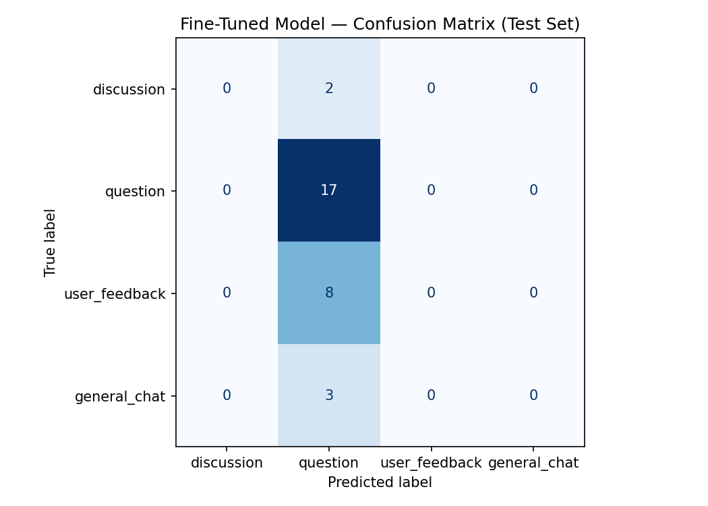

# TakeMeter: r/TeamfightTactics Discourse Classifier

## Project Overview

TakeMeter is a fine-tuned text classifier that categorizes posts from the r/TeamfightTactics subreddit into four discourse types: discussion, question, user_feedback, and general_chat. The model is built by fine-tuning DistilBERT on 200+ labeled examples and compared against a zero-shot Groq baseline to measure the value of task-specific fine-tuning.

**GitHub Repository:** https://github.com/Uye121/ai201-project3-takemeter

---

## Community Choice and Reasoning
r/TeamfightTactics
**Platform:** Reddit

**Why this community:** Teamfight Tactics (TFT) is a strategy autobattler with a highly active subreddit community. Posts range from detailed strategy guides and gameplay questions to emotional reactions about balance patches and casual meme-sharing. The discourse is text-heavy, diverse in quality, and has natural categories that community members themselves recognize: help-seeking, strategy discussion, feedback/criticism, and casual chat.

**Good fit for classification:** The TFT community produces content that naturally falls into distinct categories that matter to participants. A player seeking help with a comp wants different responses than someone venting about balance, and the community's norms reflect these distinctions. This variation makes it an ideal test case for discourse classification.

---

## Label Taxonomy
My labels capture four distinct post types in the TFT community:

### 1. discussion

**Definition:** Posts that ask for others' opinions, seek to create conversation, explore a specific topic, or encourage peer-to-peer interaction about gameplay mechanics, strategy, or community topics. Typically include phrases like "anyone thinks", "what do you think about", or open-ended questions that invite debate rather than a single answer.

**Examples:**

"I personally believe the designers had in mind that the space gods were suppose to be encounters and retaining similar augment choices but now considered 'gifts' on each stage. Instead of having two space gods per game, there is only one per game, with three choices from their pool of gifts. Everyone gets the same boon at the end as well. I feel if it was more streamlined that way, there would not be certain biases towards certain gods and certain unbalancing issues since everyone gets the same boon in the end and not dealing with the two third choices shenanigans at the end. What do you think?"

"What is your overall opinion on Set 17 so far? Feel free to justify your choice in the comments"

### 2. question

**Definition:** Posts seeking personal help, specific information, or clarification on gameplay mechanics, strategy, cosmetics, technical issues, or community norms. The post requests actionable advice rather than general opinions—the poster has a specific problem they want solved.

**Examples:**

"I've been playing a lot the last few days (I'm only play 1, got emerald 2 last season but haven't hit yet) so I like to think I have a good base understanding of the game & units. But I think my decision making is the problem. What do I do if I've commit to for example Diana reroll which uses 4 or 5 3 costs and I don't get a reroll augment? Do I just come 6th? Should I be pivoting to something else? Also, when should I roll? I usually slow roll for a few rounds and then when I'm down to 2 or 3 lives I commit and almost always miss then spend the next 2-4 rounds donkey rolling in desperation of hitting"

"Is there any cool/unique comps with bilge water in pengu? I already played something with pretty much all the traits but i can't seem to build something with bilge water to make it work. Has anyone of you find anything?"

### 3. user_feedback

**Definition:** Posts expressing opinions, complaints, praise, or suggestions about game design, patch changes, balance, specific champions/traits, or community moderation. These posts often contain emotional language, data-backed claims, or personal anecdotes about game experience. The key distinction from discussion is that feedback conveys a judgment or evaluation rather than exploring multiple perspectives.

**Examples:**

"Maybe this is a crazy question, but genuinely this trait feels so underwhelming. I've got shepherd 7 in both normal games and the anniversary mode (with 2 coven, no less, giving my Bia and Bayin 110 AP and infinite mana) and both times I didn't get close to winning. I had good backline carries but ofc there are ways to ignore frontline so they just got melted and Bia & Bayin couldn't carry at that point. Not sure what I'm doing wrong, honestly."

"I think artifacts should list good users of the items, such as recommended items and even psionic letting you what items are okay for the champ. Its so hard for new players to know who to put a link Bane on, or get four artifacts they don't know and have to choose one not good for their comp."

### 4. general_chat

**Definition:** Posts that don't fit the other three categories. Includes achievement posts, memes, casual observations, off-topic content, or any post not primarily about strategy help, feedback, or discussion-oriented debate.

**Examples:**

"after 800 'different' morgana and gwen chibis or whatever i think it's time for a breath of fresh air. Thank you for your attention to this matter"

"I love Pengu's Party because you get to see many creative team comps — this was just a generic galaxy start (not sona)"

---

## Data Collection and Annotation

### Data Source

All posts were collected from the r/TeamfightTactics subreddit using a Python scraping script with PRAW (Reddit API). Posts containing images were excluded because they rely on visual context that DistilBERT cannot parse.

**Total Examples:** 200
**Time Frame:** Posts from recent TFT sets (Sets 16-17)

### Labeling Process
**Approach:** Hybrid — AI-assisted pre-labeling with manual review

**Pre-labeling:** I designed a prompt for Deepseek to classify each post based on my label definitions. The AI processed all posts and assigned initial labels. This reduced annotation time by ~2 hours.

**Manual Review:** I reviewed every AI-assigned label and corrected misclassifications. This was essential because:

The AI sometimes struggled with borderline cases (discussion vs. question)

Emotional language in feedback posts occasionally misled the AI

Short posts required human judgment for context

**Time Spent:** ~1.5 hours total (AI processing + manual verification)

**Quality Assurance:** For each difficult case, I referenced the decision rules established in my planning.md. I kept a running log of cases that required judgment calls.

### Label Distribution

| Label | Count | Percentage |
|-------|-------|------------|
| discussion | 9 | 4.5% |
| question | 117 | 58.5% |
| user_feedback | 54 | 27% |
| general_chat | 20 | 10% |

**Imbalance Note:** As expected in a help-oriented subreddit, question posts dominate. General_chat is underrepresented because image-based memes (which would fall here) were excluded.

**Data Note:** The post title is combined with the post content with a separator [SEP] in between in order to fully capture the poster's true intentions.

### Difficult Labeling Examples

#### Example 1: Question vs Discussion

**Post title:** What Type of Player Is the Three Emblem Encounter For?

**Post:** Just interested in hearing what type of players enjoy this encounter. I could be very wrong, but my current understanding is that casual players tend to enjoy forcing comps, with less flexible gameplay and decisionmaking. And competitive players tend to not enjoy that level of RNG dictating the game. Whenever I get this encounter, it's immediately obvious if a person's chances at winning went up or down, and that's all before anyone has even bought a single unit, picked a single augment, or made any decision in the match at all. I think it can enable really interesting and unique gameplay choices (such as knowing when to ignore one or two of your emblems, or knowing how to flex them all in to your comp), but more often than not it just feels like the game decided how your match is going to go.

**Ambiguity:** Could be question or discussion.

**Decision:** Labeled as discussion. Although the title of the post is posed as a question, the post explicitly invite others' perspective and explain their own thought process.

#### Example 2: Question vs User Feedback

**Post title:** How do yall win with Shepherd 7???

**Post:** Maybe this is a crazy question, but genuinely this trait feels so underwhelming. I've got shepherd 7 in both normal games and the anniversary mode (with 2 coven, no less, giving my Bia and Bayin 110 AP and infinite mana) and both times I didn't get close to winning. I had good backline carries but ofc there are ways to ignore frontline so they just got melted and Bia & Bayin couldn't carry at that point. Not sure what I'm doing wrong, honestly.

**Ambiguity:** Could be question or user_feedback (on how bad the team composition and traits are).

**Decision:** Labeled as question. The poster is more of asking how is it possible to win with 7 shepherd trait because their units got defeated very fast. They don't know what the issue is.

#### Example 3: Discussion vs User Feedback

**Post title:** My counter to space groove

**Post:** I have the perfect counter to space groove that has carried me right up through to diamond first, keep an eye out and pickup any space groove units you see. Hurt their early game by taking their units. Then, as the game progresses, grab ornn and samira. Doesn't matter what the rest of your comp or items are. Just get these two Now at 7? Reroll for them, try to get as many as possible to take them from other space groove players and finally, the genius of the plan, level up and grab Nami and Blitz, their final units and cap out at 7 space groove. Even if you don't 3* anyone, 2* Ornn and Samira will allow you to top 4. After 20...maybe 30 games you will climb to emerald or diamond

**Ambiguity:** Could be discussion or user_feedback (bug report).

**Decision:** Labeled as user_feedback. The post explains a strategy about how to counter space groove teams. It is an informational post about the game itself.

---

## Fine-Tuning Approach

**Model:** distilbert-base-uncased (66M parameters)

**Why this model:**

**Lightweight:** Fast to fine-tune on a free T4 GPU (5-15 minutes)

**Good performance:** DistilBERT retains 95% of BERT's performance with 40% fewer parameters

**Uncased:** Appropriate for informal social media text where capitalization is inconsistent

**Deployable:** Small enough for real-world applications

### Training Setup

**Framework:** Hugging Face transformers + datasets + scikit-learn
**Hardware:** Google Colab T4 GPU (free tier)
**Training Time:** ~10 minutes for 200+ examples
**Split:** 70% train / 15% validation / 15% test

### Hyperparameter Decisions

**Learning Rate:** 2e-5
This is the standard starting point for fine-tuning DistilBERT and works well for small datasets. Higher rates (e.g., 5e-5) risk destabilizing the pre-trained weights with limited data. Lower rates (e.g., 1e-5) might underfit on 200 examples. 2e-5 balances learning speed with stability.

**Epochs:** 3
3 epochs is a conservative choice that allows the model to see each example multiple times without memorizing noise.

**Batch Size:** 16
T4 GPU has 16GB VRAM, and a batch size of 16 is safe for DistilBERT while providing stable gradient estimates.

---

## Baseline Comparison

Zero-Shot Baseline Setup
**Model:** Groq's llama-3.3-70b-versatile
**Method:** Zero-shot classification with no task-specific training

**Prompt Used:**
```
You are classifying TeamfightTactics subreddit posts into one of four categories:

1. discussion: Posts asking for opinions, seeking conversation, or exploring topics. Usually includes phrases like "what do you think" or "anyone else".

2. question: Posts seeking personal help, specific information, or clarification. Usually asks "what should I do" or "how do I" with a clear problem to solve.

3. user_feedback: Posts expressing opinions, complaints, or praise about game design, patches, or balance. Often contains emotional language or evaluation.

4. general_chat: Posts about achievements, memes, casual observations, or anything not fitting above.

Classify this post. Return only the label name (one of: discussion, question, user_feedback, general_chat) with no additional text or explanation.

Post: {post_text}
```

---

## Evaluation Report

### Overall Performance Comparison

| Model | Accuracy |
|--------|---------|
| Groq Zero-Shot | 58.3% |
| Fine-Tuned DistilBERT | 56.7% |

Groq Zero-Shot performed slightly better than the Fine-Tuned DistilBERT. This makes sense given the small dataset with class imbalance. Groq benefitted from having billions of parameters and can reason better.

### Confusion Matrix


---

## Sample Classification

#### Example 1:

**Title:** How do yall win with Shepherd 7???
**Post:** Maybe this is a crazy question, but genuinely this trait feels so underwhelming. I've got shepherd 7 in both normal games and the anniversary mode (with 2 coven, no less, giving my Bia and Bayin 110 AP and infinite mana) and both times I didn't get close to winning. I had good backline carries but ofc there are ways to ignore frontline so they just got melted and Bia & Bayin couldn't carry at that point. Not sure what I'm doing wrong, honestly.
**Predicted:** question
**Actual:** question
**Why it succeeded:** The model correctly predicted "question" for this post because the text contains strong signal that aligns with the question category. The title explicitly asks a question with multiple question marks. Despite the content containing feedbacks and emotional language, its primary intent is to ask others to help with playing this particular team composition. The explicit help-seeking language ("How do yall win," "Not sure what I'm doing wrong") provided unambiguous signals that outweighed the complaint elements, allowing the model to make the correct classification despite the post being a classic edge case.

#### Example 2:

**Title:** I think artifacts should list good users of the items, such as recommended items and even psionic letting you what items are okay for the champ.
**Post:** Its so hard for new players to know who to put a link Bane on, or get four artifacts they don't know and have to choose one not good for their comp.
**Predicted:** question
**Actual:** user_feedback
**Why it failed:** The poster is clearly posting a suggestion of what they think would be good for the game, especially for those who are new to the game. Maybe the model sees the word what and assumes it's a question.

#### Example 3:

**Title:** Design Intention: Space Gods
**Post:** I personally believe the designers had in mind that the space gods were suppose to be encounters and retaining similar augment choices but now considered \"gifts\" on each stage. Instead of having two space gods per game, there is only one per game, with three choices from their pool of gifts. Everyone gets the same boon at the end as well. I feel if it was more streamlined that way, there would not be certain biases towards certain gods and certain unbalancing issues since everyone gets the same boon in the end and not dealing with the two third choices shenanigans at the end. What do you think?
**Predicted:** question
**Actual:** discussion
**Why it failed:** The model predicted "question" for this post because it fixated on the closing phrase "What do you think?" while ignoring the preceding text, which presents a structured argument with a clear claim, supporting evidence, and analysis. The model made a surface-level assumption and failed to distinguish the post's intention of inviting a discussion.

#### Example 4:

**Title:** What's with people calling rerolling metaslaves?
**Post:** This is something that's really been bothering me since the beginning of this set. With this meta usually being about rerolling, people keep saying that the strategy is uncreative metaslave compared to Fast 9, but isn't the point of any competitive game that different playstyles become meta over time? I mean, it's not that Fast 9 has become weak (after all, 5-cost pieces should always be strong because otherwise they wouldn't be legendary, right?), the only thing that changed is the way to play it and build the composition. And let's face it, Fast 9 in the previous set wasn't difficult at all since it didn't depend solely on playing aggressively with a lot of health like it does now (it's no coincidence that pivoting from Yordle to Annie was playable).
**Predicted:** question
**Actual:** user_feedback
**Why it failed:** The model is fixated on the title and misinterpreting it as a question rather than being a rhetorical question. The body of the text support this by expressing a a sustained complaint about community attitudes toward a specific playstyle, which the model failed to take note of. The model seems to have a bias towards labeling things as questions if there are question marks.

---

## Reflection

### What I intended:

I wanted the model to be able to distinguish between discussion, question, user feedback, and general chat.

### What the model actually learned:

The model learned that most posts are questions, so it strongly bias towards question even for ambiguous cases. This is a result of the unbalanced dataset and limited examples from the other categories. When it sees question mark or question words (e.g. what), it will assume it's a question, disregarding other contextual information.

### The Gap:
Language vs. Intent. The model learned surface-level language patterns (question marks, "I think", "should", "how do I") rather than the deeper conversational intent I defined. Discussion and feedback are distinguished by intent (conversation vs. evaluation), but both use similar language. With 200 examples, the model couldn't capture these nuanced distinctions.

### What Would Fix It:

1. More balanced dataset
2. Clearer decision boundaries
3. Data augmentation techniques
4. Use ensemble methods

---

## Spec Reflection

### How the Spec Helped:

The spec's emphasis on label design before data collection was crucial. It helped me think more deeply about how to better divide the reddit posts in order to create a more balanced dataset, although it didn't quite worked out as the TFT subreddit is full of questions.

### How I Diverged:

I initially tried the category strategy instead of discussion, which made the dataset even more imbalanced due to there being a lot of posts questioning strategies and the meta, rather than posting solid strategies to win the game.

---

## AI Usage

I used DeepSeek to generate code to scrape data from Reddit and to pre-label the data before manually going through the data myself. I also used DeepSeek to generate the planning and README template based on what is required.